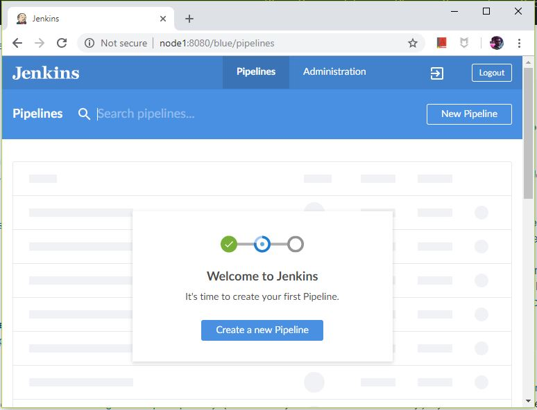
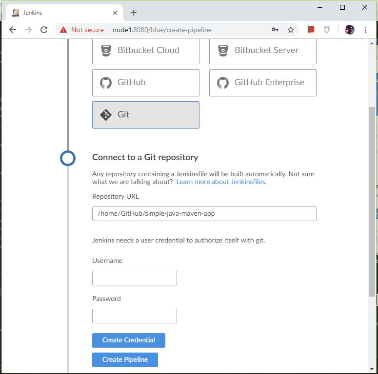
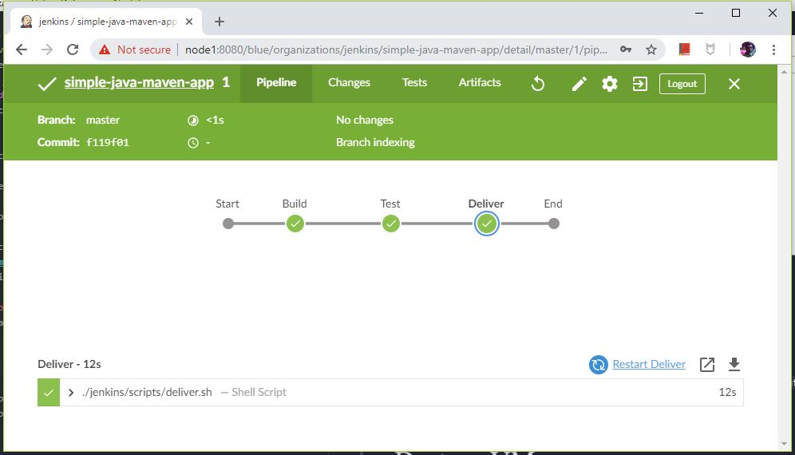

# simple-java-maven-app

This repository is for the
[Build a Java app with Maven](https://jenkins.io/doc/tutorials/build-a-java-app-with-maven/)
tutorial in the [Jenkins User Documentation](https://jenkins.io/doc/).

The repository contains a simple Java application which outputs the string
"Hello world!" and is accompanied by a couple of unit tests to check that the
main application works as expected. The results of these tests are saved to a
JUnit XML report.

The `scripts` subdirectory contains a shell script with commands that are executed when Jenkins processes the "Deliver" stage of your Pipeline.

# Create VM
1. Change to a suitable directory
1. Clone this repository and change directory: `git clone https://github.com/shazChaudhry/simple-java-maven-app.git && cd simple-java-maven-app`
1. Create a ubuntu based VM in a VirtualBox by running: `vagrant box update; vagrant box prune; vagrant up` _(It is assumed you have already installed latest versions of VirtualBox, Vagrant and Git BASH. My environment is Windows 10 Pro)_
1. SSH in to the VM once it has been created: `vagrant ssh`

# Jenkins startup
1. Once inside the VM change the directory: `cd /vagrant` _(This directory contains the cloned repo)_
1. Start Jenkins by executing the launch script: `./launch_jenkins.sh` _(The cloned repo is mounted in the container at "/home/GitHub/simple-java-maven-app")_. The content of this script is as follows:
      ```
      docker container run -d \
      --rm \
      --user root \
      --name jenkins \
      --publish 8080:8080 \
      --volume jenkins-data:/var/jenkins_home \
      --volume /var/run/docker.sock:/var/run/docker.sock \
      --volume $PWD:/home/GitHub/simple-java-maven-app \
      jenkinsci/blueocean
      ```
1. After a minute or so, Jenkins should be accessible at http://node1:8080/blue/pipelines _(If required, instructions are available [here](https://jenkins.io/doc/tutorials/build-a-java-app-with-maven/#accessing-the-jenkinsblue-ocean-docker-container) on how to run the setup wizard and to unlock Jenkins)_


# Create multi-branch pipeline
1. Follow the "Create a new Pipeline" wizard to create a pipeline defined in the Jenkinsfile
1. Type in "Repository URL" when asked: `/home/GitHub/simple-java-maven-app` _(this was the directory that was mounted in when Jenkins started)_ 
1. Leave username and password fields empty
1. Click on "Create Pipeline" button which will create and start a pipeline 

# Jenkins shutdown
In order to stop and remove the container, run the following command: `docker container stop jenkins`

# Destroy VM
1. Exit the VM: execute `exit` in the terminal
1. Then in the host terminal, exeute `vagrant destroy --force`
